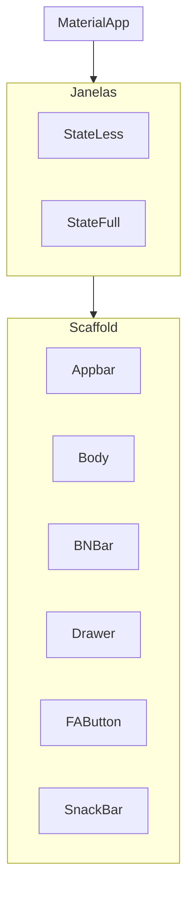

##  Introdução ao desenvolvimento Mobile

## Tipos de desenvolvimento 

- Nativo
    - Android:
        - SDK : Andoid SDK
        - IDE: Android Studio
        - Linguagens: Kotlin e Java
        - Ambientes: Mac, Win, Linux

    - Ios:
        -SDK: Cocoa Touch
        IDE: Xcode
        - Linguagens: Swift / Objectype-C
        - Ambientes de Dev: Mac
    
- Multiplataforma
    - React Native:
        - SDK: Node.JS
        - IDE: VSCode, 
        - Linguagens: Javascript / TypeScript
        - Amientede de dev: Mac, Win, Linux . . .

        - Flutter
            - SDK: Fluter SDK
            -IDE: VSCode, Android Studio
            - Linguagens: Dart
            -Ambiente: Mac, Win, Linux

    ## Preparação do ambiente do sistema de Desenvolvimento

    ### Instalaçao do FlutterSDK
    - download do arquivo ZIP na página flutter.dev
    - inclusão do flutter na pasta c:\src
    - inclusão do flutter\bin nas variáveis de ambiente
    - teste o flutter --version

    ### Instalação do AndroidSDK
    - download do adroid Sdk - Command line tools
    - adicionar o command-line ao C:\src\androidSDK
    - adicionar o SDKManager as variáveis de ambiente
    - download dos pacotes
        - emulador
        - platforms
        - platform-tools
        - build-tools
    - adicionar ADB e p emulator as ariáveis de ambiente
    
    - Criação da imagem do emulador - via sdkmanager
    - Build do Emulador - via sdkmanager
        
    ### Criação de Projetos e códios da Linha de Comando

    - criação de projetos
        - flutter create nome_do_app
            - flags (Marcação no projeto, parâmetros)
                - --empty : Cria um aplicativo "vazio"(hello world!)
                - --platforms : Permite a selção de uma plataforma de desevolvimento
                    - ex --platforms=android (a criação do projeto será somente para a plataforma android)
        - exemplo de criação de um aplicativo android vazio
            - flutter create nome-do-app --empty --platforms=andoid
            - obs: nome do aplicativo: todas as letras minúsculas, separação de palavras com "_";
        - flutter doctor 
            - permite correção de pequnos problemas no flutter e identificação dos parâmetros funcionais em relação as plataformas de desenvolvimento
            - sempre rodar o doctar no começo do desenvolvimento
        - flutter clean
             - limpa cache do build(apaga o apk anterior)
             - APK (É o formato de arquivo do android, igual ao .exe do windows)
        - fluter run -v
            - build do app (APK)

    # Depêndencias = Biblioteca

        - O pubget é como se fosse o pip install do Python
            - Instalação
                - flutter pub add nome_dependencia
            - Baixar e instalar dependências projetadas
                - flutter pub get
            - outros comandos do flutter pub (dependências)
                - flutter pub outdated (verifica se as dependências estão desatualizadas)
                - fluter pub apgrade (atualiza as dependências do flutter pub)

    ### Estrutura Básica de um aplicativo em Flutter

    #### Árvore de Widgets

#### Tipos de Janelas

- StateLess:
    Janelas Imutáveis - Uma vez construida ela não se altera
    obs: Pode Ter Movimento: (GIF, Movies, Carrossel, Cards) Mas não consigo alterar as imagens, os vídeos e os elementos de ovimento depois de montados

    -  StateFull:
        janelas que permitem Mudança de Estado(SetState)
        obs: Permite Adicionar elementos a Janela, Como novasa Imagens, Novos Textos entre outros.